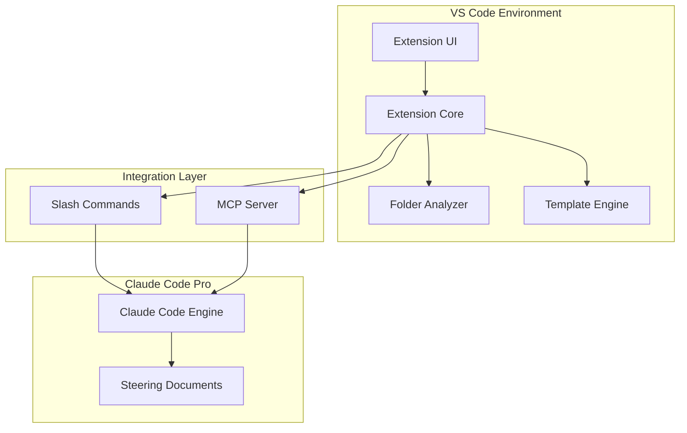

# Technical Design Document
## Documentation Generator VS Code Extension

**Version:** 1.0
**Date:** September 19, 2025
**Author:** Solution Architecture Team
**Status:** Draft

---

## Table of Contents
1. [System Overview](#system-overview)
2. [Architecture Design](#architecture-design)
3. [Component Specifications](#component-specifications)
4. [Data Models](#data-models)
5. [Integration Patterns](#integration-patterns)
6. [User Interface Design](#user-interface-design)
7. [Security Design](#security-design)
8. [Performance Considerations](#performance-considerations)
9. [Deployment Architecture](#deployment-architecture)
10. [Testing Strategy](#testing-strategy)

---

## System Overview

### High-Level Architecture

The Documentation Generator Extension follows a hybrid architecture combining VS Code extension capabilities with Claude Code Pro integration through two primary communication channels:

1. **Slash Commands Integration**: Dynamic command generation and execution
2. **MCP Server Integration**: Real-time communication bridge



### System Boundaries

**In Scope:**
- VS Code extension development and UI
- Local file system analysis and processing
- Template management and generation
- Claude Code Pro integration
- Team configuration management

**Out of Scope:**
- External API integrations
- Cloud-based storage or processing
- Real-time collaboration features
- Advanced AI model training or customization

---

## Architecture Design

### Component Architecture

```typescript
// High-level component structure
interface SystemArchitecture {
  presentation: {
    sidebar: SidebarProvider;
    contextMenus: ContextMenuProvider;
    settings: SettingsProvider;
  };

  business: {
    documentGenerator: DocumentGeneratorService;
    templateManager: TemplateManagerService;
    folderAnalyzer: FolderAnalyzerService;
    claudeIntegrator: ClaudeIntegratorService;
  };

  integration: {
    commandGenerator: SlashCommandService;
    mcpServer: MCPServerService;
    fileSystemBridge: FileSystemBridgeService;
  };

  infrastructure: {
    configuration: ConfigurationService;
    logging: LoggingService;
    errorHandling: ErrorHandlingService;
  };
}
```

### Layered Architecture

#### 1. Presentation Layer
- **Responsibility**: User interface components and user interaction handling
- **Components**: Sidebar panels, context menus, dialogs, settings pages
- **Technologies**: VS Code Extension API, TypeScript, React (for complex UIs)

#### 2. Business Logic Layer
- **Responsibility**: Core business operations and domain logic
- **Components**: Document generation, template processing, folder analysis
- **Technologies**: TypeScript, Node.js utilities

#### 3. Integration Layer
- **Responsibility**: External system communication and data transformation
- **Components**: Claude Code integration, MCP server, file system operations
- **Technologies**: Node.js, IPC, stdio communication

#### 4. Infrastructure Layer
- **Responsibility**: Cross-cutting concerns and system utilities
- **Components**: Configuration, logging, error handling, caching
- **Technologies**: VS Code settings API, file system APIs

### Communication Patterns

#### VS Code Extension ↔ MCP Server
```typescript
interface ExtensionMCPCommunication {
  // IPC-based communication
  sendContext(folderPath: string, template: string): Promise<void>;
  receiveResult(): Promise<DocumentResult>;

  // Event-driven updates
  onFolderSelected: EventEmitter<FolderContext>;
  onTemplateChanged: EventEmitter<TemplateInfo>;
  onGenerationComplete: EventEmitter<DocumentResult>;
}
```

#### Extension ↔ Claude Code
```typescript
interface ClaudeCodeIntegration {
  // Slash command execution
  executeSlashCommand(command: string, context: string): Promise<string>;

  // MCP resource provision
  provideResource(resourceId: string): Promise<ResourceData>;

  // Result handling
  parseClaudeOutput(output: string): DocumentResult;
}
```

---

## Component Specifications

### 1. Extension Core (`src/extension.ts`)

```typescript
export class DocumentationGeneratorExtension {
  private services: Map<string, any> = new Map();

  async activate(context: vscode.ExtensionContext): Promise<void> {
    // Initialize core services
    this.initializeServices(context);

    // Register UI providers
    this.registerUIProviders(context);

    // Setup command handlers
    this.registerCommands(context);

    // Start MCP server if enabled
    await this.startMCPServer();
  }

  private initializeServices(context: vscode.ExtensionContext): void {
    this.services.set('config', new ConfigurationService(context));
    this.services.set('logger', new LoggingService(context));
    this.services.set('analyzer', new FolderAnalyzerService());
    this.services.set('templates', new TemplateManagerService());
    this.services.set('claude', new ClaudeIntegratorService());
  }
}
```

### 2. Folder Analyzer Service (`src/services/FolderAnalyzerService.ts`)

```typescript
export class FolderAnalyzerService {
  async analyzeFolderContext(folderPath: string): Promise<FolderContext> {
    const analysis: FolderContext = {
      path: folderPath,
      structure: await this.buildFolderStructure(folderPath),
      files: await this.analyzeFiles(folderPath),
      dependencies: await this.extractDependencies(folderPath),
      documentation: await this.findExistingDocs(folderPath),
      metadata: await this.extractMetadata(folderPath)
    };

    return analysis;
  }

  private async buildFolderStructure(path: string): Promise<FolderStructure> {
    // Recursive folder traversal with exclusion patterns
    return {
      directories: await this.getDirectories(path),
      files: await this.getFiles(path),
      totalSize: await this.calculateSize(path),
      fileTypes: await this.categorizeFiles(path)
    };
  }

  private async analyzeFiles(path: string): Promise<FileAnalysis[]> {
    const files = await this.getRelevantFiles(path);
    return Promise.all(files.map(file => this.analyzeFile(file)));
  }

  private async analyzeFile(filePath: string): Promise<FileAnalysis> {
    const content = await fs.readFile(filePath, 'utf-8');
    return {
      path: filePath,
      type: this.detectFileType(filePath),
      size: content.length,
      functions: this.extractFunctions(content),
      classes: this.extractClasses(content),
      imports: this.extractImports(content),
      exports: this.extractExports(content),
      comments: this.extractComments(content),
      complexity: this.calculateComplexity(content)
    };
  }
}
```

### 3. Template Manager Service (`src/services/TemplateManagerService.ts`)

```typescript
export class TemplateManagerService {
  private templateCache: Map<string, Template> = new Map();

  async loadTemplate(templateName: string): Promise<Template> {
    if (this.templateCache.has(templateName)) {
      return this.templateCache.get(templateName)!;
    }

    const templatePath = this.resolveTemplatePath(templateName);
    const template = await this.parseTemplate(templatePath);
    this.templateCache.set(templateName, template);

    return template;
  }

  async processTemplate(template: Template, context: FolderContext): Promise<string> {
    let content = template.content;

    // Process template variables
    content = await this.substituteVariables(content, context);

    // Process conditional sections
    content = await this.processConditionals(content, context);

    // Process loops and iterations
    content = await this.processIterations(content, context);

    // Post-process formatting
    content = await this.formatOutput(content, template.outputFormat);

    return content;
  }

  private async substituteVariables(content: string, context: FolderContext): Promise<string> {
    const variables: Record<string, any> = {
      folder_name: path.basename(context.path),
      file_count: context.files.length,
      total_size: context.structure.totalSize,
      file_list: context.files.map(f => f.path).join('\n'),
      // Add AI-generated variables
      ...await this.generateAIVariables(context)
    };

    return content.replace(/\$\{([^}]+)\}/g, (match, varName) => {
      return variables[varName] || match;
    });
  }
}
```

### 4. Claude Integrator Service (`src/services/ClaudeIntegratorService.ts`)

```typescript
export class ClaudeIntegratorService {
  private commandGenerator: SlashCommandGenerator;
  private mcpClient: MCPClient;

  constructor() {
    this.commandGenerator = new SlashCommandGenerator();
    this.mcpClient = new MCPClient();
  }

  async generateDocument(
    folderContext: FolderContext,
    template: Template
  ): Promise<DocumentResult> {

    // Determine integration method based on configuration
    const method = this.getIntegrationMethod();

    if (method === 'slash-commands') {
      return this.generateViaSlashCommands(folderContext, template);
    } else {
      return this.generateViaMCP(folderContext, template);
    }
  }

  private async generateViaSlashCommands(
    context: FolderContext,
    template: Template
  ): Promise<DocumentResult> {

    // Generate dynamic slash command
    const command = await this.commandGenerator.createCommand({
      name: `generate-${template.name.toLowerCase()}`,
      description: `Generate ${template.name} for ${context.path}`,
      context: context,
      template: template,
      prompt: await this.buildPrompt(context, template)
    });

    // Write command to .claude/commands/
    const commandPath = await this.writeCommandFile(command);

    // Execute command in Claude Code
    const result = await this.executeCommand(commandPath);

    // Clean up temporary command
    await this.cleanupCommand(commandPath);

    return this.parseResult(result);
  }

  private async generateViaMCP(
    context: FolderContext,
    template: Template
  ): Promise<DocumentResult> {

    // Send context to MCP server
    await this.mcpClient.sendContext(context);

    // Request document generation
    const result = await this.mcpClient.requestGeneration(template);

    return this.parseResult(result);
  }
}
```

### 5. MCP Server (`src/mcp/MCPServer.ts`)

```typescript
export class DocumentationMCPServer {
  private server: Server;
  private context: Map<string, FolderContext> = new Map();

  constructor() {
    this.server = new Server({
      name: "documentation-generator",
      version: "1.0.0"
    }, {
      capabilities: {
        resources: {},
        tools: {}
      }
    });

    this.setupResourceHandlers();
    this.setupToolHandlers();
  }

  private setupResourceHandlers(): void {
    this.server.setRequestHandler(ListResourcesRequestSchema, async () => {
      return {
        resources: [
          {
            uri: "context://selected-folder",
            name: "Selected Folder Context",
            description: "Analysis of the currently selected folder"
          },
          {
            uri: "templates://available",
            name: "Available Templates",
            description: "List of available documentation templates"
          }
        ]
      };
    });

    this.server.setRequestHandler(ReadResourceRequestSchema, async (request) => {
      const { uri } = request.params;

      if (uri === "context://selected-folder") {
        return {
          contents: [{
            uri,
            mimeType: "application/json",
            text: JSON.stringify(this.getCurrentContext())
          }]
        };
      }

      throw new Error(`Unknown resource: ${uri}`);
    });
  }

  private setupToolHandlers(): void {
    this.server.setRequestHandler(CallToolRequestSchema, async (request) => {
      const { name, arguments: args } = request.params;

      switch (name) {
        case "generate-documentation":
          return this.handleDocumentGeneration(args);
        case "analyze-folder":
          return this.handleFolderAnalysis(args);
        default:
          throw new Error(`Unknown tool: ${name}`);
      }
    });
  }
}
```

---

## Data Models

### Core Data Structures

```typescript
interface FolderContext {
  path: string;
  structure: FolderStructure;
  files: FileAnalysis[];
  dependencies: DependencyInfo[];
  documentation: ExistingDoc[];
  metadata: ProjectMetadata;
}

interface FolderStructure {
  directories: string[];
  files: string[];
  totalSize: number;
  fileTypes: Record<string, number>;
  depth: number;
  excludedPaths: string[];
}

interface FileAnalysis {
  path: string;
  type: FileType;
  size: number;
  lastModified: Date;
  functions: FunctionInfo[];
  classes: ClassInfo[];
  imports: ImportInfo[];
  exports: ExportInfo[];
  comments: CommentInfo[];
  complexity: ComplexityMetrics;
}

interface Template {
  name: string;
  description: string;
  version: string;
  content: string;
  variables: TemplateVariable[];
  sections: TemplateSection[];
  outputFormat: 'markdown' | 'html' | 'pdf';
  metadata: TemplateMetadata;
}

interface DocumentResult {
  content: string;
  metadata: {
    template: string;
    generated: Date;
    folderPath: string;
    wordCount: number;
    sections: string[];
  };
  quality: QualityMetrics;
  suggestions: string[];
}
```

### Configuration Models

```typescript
interface ExtensionConfiguration {
  templates: {
    defaultPath: string;
    customPaths: string[];
    autoUpdate: boolean;
  };

  generation: {
    outputPath: string;
    naming: NamingConvention;
    formats: OutputFormat[];
    postProcessing: PostProcessingOptions;
  };

  analysis: {
    maxFileSize: number;
    excludePatterns: string[];
    includeHidden: boolean;
    maxDepth: number;
  };

  claude: {
    integrationMethod: 'slash-commands' | 'mcp' | 'hybrid';
    commandPrefix: string;
    mcpServerPort: number;
    timeoutMs: number;
  };

  team: {
    sharedTemplates: boolean;
    configSyncPath: string;
    permissions: TeamPermissions;
  };
}
```

---

## Integration Patterns

### Slash Command Integration Pattern

```typescript
class SlashCommandGenerator {
  async createCommand(spec: CommandSpec): Promise<SlashCommand> {
    const command: SlashCommand = {
      name: spec.name,
      description: spec.description,
      content: this.buildCommandContent(spec),
      metadata: {
        allowedTools: ['Read', 'Write', 'Bash'],
        argumentHint: '[template-name] [options]',
        timeout: 60000
      }
    };

    return command;
  }

  private buildCommandContent(spec: CommandSpec): string {
    return `
---
description: ${spec.description}
allowed-tools: Read(*), Write(*), Edit(*)
argument-hint: [folder-path] [template-name]
---

Generate ${spec.template.name} documentation for the specified folder.

**Context:**
${this.formatContext(spec.context)}

**Template:** ${spec.template.name}

**Instructions:**
${spec.prompt}

**Output Requirements:**
- Follow the template structure exactly
- Include all required sections
- Use proper markdown formatting
- Save to the configured output directory
`;
  }
}
```

### MCP Resource Provision Pattern

```typescript
class MCPResourceProvider {
  async provideResource(resourceUri: string): Promise<ResourceContent> {
    const parts = resourceUri.split('://');
    const [scheme, path] = parts;

    switch (scheme) {
      case 'context':
        return this.provideFolderContext(path);
      case 'template':
        return this.provideTemplate(path);
      case 'config':
        return this.provideConfiguration(path);
      default:
        throw new Error(`Unknown resource scheme: ${scheme}`);
    }
  }

  private async provideFolderContext(path: string): Promise<ResourceContent> {
    const context = await this.folderAnalyzer.analyzeFolderContext(path);
    return {
      mimeType: 'application/json',
      text: JSON.stringify(context, null, 2)
    };
  }
}
```

### Event-Driven Communication Pattern

```typescript
class ExtensionEventBus {
  private emitter = new EventEmitter();

  // Extension events
  onFolderSelected(handler: (folder: string) => void): void {
    this.emitter.on('folder.selected', handler);
  }

  onTemplateChanged(handler: (template: Template) => void): void {
    this.emitter.on('template.changed', handler);
  }

  onGenerationStarted(handler: (job: GenerationJob) => void): void {
    this.emitter.on('generation.started', handler);
  }

  onGenerationCompleted(handler: (result: DocumentResult) => void): void {
    this.emitter.on('generation.completed', handler);
  }

  // MCP server events
  broadcastToMCP(event: string, data: any): void {
    this.mcpServer.notify(event, data);
  }
}
```

---

## User Interface Design

### Component Hierarchy

```
Extension Sidebar (TreeDataProvider)
├── Quick Actions Panel
│   ├── Generate Help Docs Button
│   ├── Create PRD Button
│   ├── Make Spec Button
│   └── Custom Action Button
├── Template Management Panel
│   ├── Available Templates Tree
│   ├── Create Template Button
│   └── Import/Export Actions
├── Recent Generations Panel
│   ├── History List
│   ├── Re-generate Actions
│   └── Open Generated Docs
└── Settings Panel
    ├── Configuration Options
    ├── Claude Integration Settings
    └── Team Settings
```

### Sidebar Provider Implementation

```typescript
export class DocumentationSidebarProvider implements vscode.TreeDataProvider<SidebarItem> {
  private _onDidChangeTreeData = new vscode.EventEmitter<SidebarItem | undefined | null | void>();
  readonly onDidChangeTreeData = this._onDidChangeTreeData.event;

  getTreeItem(element: SidebarItem): vscode.TreeItem {
    return element;
  }

  getChildren(element?: SidebarItem): Thenable<SidebarItem[]> {
    if (!element) {
      return Promise.resolve(this.getRootItems());
    }

    return Promise.resolve(element.getChildren());
  }

  private getRootItems(): SidebarItem[] {
    return [
      new QuickActionsItem(),
      new TemplateManagementItem(),
      new RecentGenerationsItem(),
      new SettingsItem()
    ];
  }
}

class QuickActionsItem extends SidebarItem {
  constructor() {
    super(
      'Quick Actions',
      vscode.TreeItemCollapsibleState.Expanded
    );
    this.iconPath = new vscode.ThemeIcon('zap');
  }

  getChildren(): SidebarItem[] {
    return [
      new ActionButtonItem('Generate Help Docs', 'generate-help'),
      new ActionButtonItem('Create PRD', 'generate-prd'),
      new ActionButtonItem('Make Spec', 'generate-spec'),
      new ActionButtonItem('Meeting Summary', 'generate-meeting')
    ];
  }
}
```

### Context Menu Provider

```typescript
export class FolderContextMenuProvider {
  static register(context: vscode.ExtensionContext): void {
    const command = vscode.commands.registerCommand(
      'documentation-generator.generateFromFolder',
      async (uri: vscode.Uri) => {
        const folder = uri.fsPath;
        const selection = await this.showDocumentTypeSelection();

        if (selection) {
          await this.triggerGeneration(folder, selection);
        }
      }
    );

    context.subscriptions.push(command);
  }

  private static async showDocumentTypeSelection(): Promise<DocumentType | undefined> {
    const items: vscode.QuickPickItem[] = [
      { label: 'Help Documentation', description: 'User-friendly help docs' },
      { label: 'PRD Document', description: 'Product requirements document' },
      { label: 'Technical Specification', description: 'Technical design document' },
      { label: 'API Documentation', description: 'API reference documentation' }
    ];

    const selection = await vscode.window.showQuickPick(items, {
      placeHolder: 'Select documentation type to generate'
    });

    return selection ? this.mapToDocumentType(selection.label) : undefined;
  }
}
```

### Progress and Status Management

```typescript
export class GenerationProgressManager {
  private currentJob: GenerationJob | null = null;

  async showProgress<T>(
    title: string,
    task: (progress: vscode.Progress<{message?: string; increment?: number}>) => Promise<T>
  ): Promise<T> {

    return vscode.window.withProgress(
      {
        location: vscode.ProgressLocation.Notification,
        title,
        cancellable: true
      },
      async (progress, token) => {
        token.onCancellationRequested(() => {
          this.cancelCurrentJob();
        });

        return task(progress);
      }
    );
  }

  async trackGeneration(job: GenerationJob): Promise<DocumentResult> {
    return this.showProgress(
      `Generating ${job.documentType}...`,
      async (progress) => {
        progress.report({ message: 'Analyzing folder structure...' });
        const context = await this.analyzer.analyzeFolderContext(job.folderPath);

        progress.report({ message: 'Loading template...', increment: 25 });
        const template = await this.templates.loadTemplate(job.templateName);

        progress.report({ message: 'Generating content...', increment: 50 });
        const result = await this.claude.generateDocument(context, template);

        progress.report({ message: 'Saving document...', increment: 75 });
        await this.saveDocument(result, job.outputPath);

        progress.report({ message: 'Complete!', increment: 100 });
        return result;
      }
    );
  }
}
```

---

## Security Design

### Data Protection Strategy

```typescript
class SecurityManager {
  // Sensitive data detection and sanitization
  sanitizeContent(content: string): string {
    const patterns = [
      /\b[A-Za-z0-9._%+-]+@[A-Za-z0-9.-]+\.[A-Z|a-z]{2,}\b/g, // emails
      /\b(?:\d{1,3}\.){3}\d{1,3}\b/g, // IP addresses
      /\b[A-Fa-f0-9]{32}\b/g, // MD5 hashes
      /\b[A-Fa-f0-9]{40}\b/g, // SHA1 hashes
      /sk-[a-zA-Z0-9]{32,}/g, // API keys pattern
    ];

    let sanitized = content;
    patterns.forEach(pattern => {
      sanitized = sanitized.replace(pattern, '[REDACTED]');
    });

    return sanitized;
  }

  // Access control for templates and configurations
  checkTemplateAccess(templatePath: string, user: UserContext): boolean {
    const template = this.loadTemplate(templatePath);

    if (template.metadata.restricted) {
      return template.metadata.allowedRoles.includes(user.role);
    }

    return true;
  }

  // Secure file operations
  async secureFileOperation(operation: () => Promise<void>): Promise<void> {
    const tempDir = await this.createSecureTempDir();

    try {
      await operation();
    } finally {
      await this.cleanupSecureTempDir(tempDir);
    }
  }
}
```

### Configuration Security

```typescript
interface SecureConfiguration {
  encryption: {
    enabled: boolean;
    algorithm: 'AES-256-GCM';
    keyDerivation: 'PBKDF2';
  };

  access: {
    templateRestrictions: boolean;
    roleBasedAccess: boolean;
    auditLogging: boolean;
  };

  privacy: {
    anonymizeOutput: boolean;
    excludeSensitiveFiles: boolean;
    redactPatterns: string[];
  };
}
```

---

## Performance Considerations

### Caching Strategy

```typescript
class PerformanceOptimizer {
  private analysisCache = new LRUCache<string, FolderContext>({ max: 100 });
  private templateCache = new LRUCache<string, Template>({ max: 50 });

  async getCachedAnalysis(folderPath: string): Promise<FolderContext | null> {
    const cacheKey = this.generateCacheKey(folderPath);
    const cached = this.analysisCache.get(cacheKey);

    if (cached && !this.isStale(cached, folderPath)) {
      return cached;
    }

    return null;
  }

  async cacheAnalysis(folderPath: string, context: FolderContext): Promise<void> {
    const cacheKey = this.generateCacheKey(folderPath);
    this.analysisCache.set(cacheKey, {
      ...context,
      cacheTimestamp: Date.now()
    });
  }

  private isStale(cached: FolderContext, folderPath: string): boolean {
    const maxAge = 5 * 60 * 1000; // 5 minutes
    const age = Date.now() - (cached as any).cacheTimestamp;
    return age > maxAge;
  }
}
```

### Batch Processing

```typescript
class BatchProcessor {
  private queue: GenerationJob[] = [];
  private processing = false;

  async queueGeneration(job: GenerationJob): Promise<void> {
    this.queue.push(job);

    if (!this.processing) {
      await this.processQueue();
    }
  }

  private async processQueue(): Promise<void> {
    this.processing = true;

    while (this.queue.length > 0) {
      const batch = this.queue.splice(0, 3); // Process 3 at a time

      await Promise.allSettled(
        batch.map(job => this.processJob(job))
      );
    }

    this.processing = false;
  }
}
```

### Memory Management

```typescript
class MemoryManager {
  private memoryThreshold = 100 * 1024 * 1024; // 100MB

  async checkMemoryUsage(): Promise<void> {
    const usage = process.memoryUsage();

    if (usage.heapUsed > this.memoryThreshold) {
      await this.performCleanup();
    }
  }

  private async performCleanup(): Promise<void> {
    // Clear caches
    this.analysisCache.clear();
    this.templateCache.clear();

    // Force garbage collection if available
    if (global.gc) {
      global.gc();
    }

    // Clean temporary files
    await this.cleanupTempFiles();
  }
}
```

---

## Deployment Architecture

### Extension Package Structure

```
documentation-generator-x.x.x.vsix
├── extension.js              # Main extension bundle
├── package.json             # Extension manifest
├── README.md               # User documentation
├── CHANGELOG.md           # Version history
├── resources/
│   ├── icons/             # Extension icons
│   └── templates/         # Default templates
├── mcp-server/
│   ├── server.js         # MCP server bundle
│   └── package.json      # Server dependencies
└── schemas/
    ├── template.schema.json
    └── config.schema.json
```

### Installation and Setup Process

```typescript
class ExtensionInstaller {
  async onFirstActivation(context: vscode.ExtensionContext): Promise<void> {
    // Check for Claude Code installation
    const claudeCodeAvailable = await this.checkClaudeCodeInstallation();

    if (!claudeCodeAvailable) {
      await this.showClaudeCodeRequirement();
      return;
    }

    // Create default directories
    await this.createDefaultDirectories();

    // Install default templates
    await this.installDefaultTemplates();

    // Setup MCP server configuration
    await this.setupMCPServerConfig();

    // Show welcome message
    await this.showWelcomeMessage();
  }

  private async setupMCPServerConfig(): Promise<void> {
    const mcpConfig = {
      servers: {
        "documentation-generator": {
          command: "node",
          args: [path.join(__dirname, "mcp-server", "server.js")],
          env: {
            WORKSPACE_PATH: vscode.workspace.workspaceFolders?.[0]?.uri.fsPath
          }
        }
      }
    };

    await this.updateClaudeCodeConfig(mcpConfig);
  }
}
```

### Update and Migration Strategy

```typescript
class ExtensionUpdater {
  async handleUpdate(previousVersion: string, currentVersion: string): Promise<void> {
    const migrations = this.getMigrations(previousVersion, currentVersion);

    for (const migration of migrations) {
      await this.runMigration(migration);
    }

    await this.updateConfigVersion(currentVersion);
  }

  private getMigrations(from: string, to: string): Migration[] {
    const migrations: Migration[] = [];

    if (semver.lt(from, '1.1.0') && semver.gte(to, '1.1.0')) {
      migrations.push(new TemplateFormatMigration());
    }

    if (semver.lt(from, '1.2.0') && semver.gte(to, '1.2.0')) {
      migrations.push(new ConfigurationMigration());
    }

    return migrations;
  }
}
```

---

## Testing Strategy

### Unit Testing Framework

```typescript
// Test structure for core components
describe('FolderAnalyzerService', () => {
  let analyzer: FolderAnalyzerService;
  let mockFileSystem: MockFileSystem;

  beforeEach(() => {
    mockFileSystem = new MockFileSystem();
    analyzer = new FolderAnalyzerService(mockFileSystem);
  });

  describe('analyzeFolderContext', () => {
    it('should analyze folder structure correctly', async () => {
      // Setup mock folder structure
      mockFileSystem.createStructure({
        'src/': {
          'index.ts': 'export * from "./components"',
          'components/': {
            'Button.tsx': 'export const Button = () => ...',
            'Input.tsx': 'export const Input = () => ...'
          }
        }
      });

      const result = await analyzer.analyzeFolderContext('/test/src');

      expect(result.structure.directories).toContain('components');
      expect(result.files).toHaveLength(3);
      expect(result.files[0].exports).toContain('Button');
    });
  });
});
```

### Integration Testing

```typescript
describe('End-to-End Document Generation', () => {
  let extension: DocumentationGeneratorExtension;
  let mockClaudeCode: MockClaudeCode;

  beforeEach(async () => {
    mockClaudeCode = new MockClaudeCode();
    extension = new DocumentationGeneratorExtension();
    await extension.activate(mockContext);
  });

  it('should generate help documentation from folder selection', async () => {
    const folderPath = '/test/api';
    const templateName = 'help-documentation';

    // Mock Claude Code response
    mockClaudeCode.mockResponse(`
# API Help Documentation

## Overview
This API provides endpoints for user management...
    `);

    const result = await extension.generateDocumentation(folderPath, templateName);

    expect(result.content).toContain('API Help Documentation');
    expect(result.metadata.template).toBe(templateName);
    expect(mockClaudeCode.getLastCommand()).toContain('help-documentation');
  });
});
```

### Performance Testing

```typescript
describe('Performance Tests', () => {
  it('should analyze large folders within time limit', async () => {
    const largeFolderPath = '/test/large-project'; // 1000+ files
    const startTime = Date.now();

    const result = await analyzer.analyzeFolderContext(largeFolderPath);

    const duration = Date.now() - startTime;
    expect(duration).toBeLessThan(10000); // 10 seconds max
    expect(result.files.length).toBeGreaterThan(1000);
  });

  it('should handle concurrent generations', async () => {
    const jobs = Array.from({ length: 5 }, (_, i) => ({
      folderPath: `/test/project-${i}`,
      template: 'help-documentation'
    }));

    const startTime = Date.now();
    const results = await Promise.all(
      jobs.map(job => extension.generateDocumentation(job.folderPath, job.template))
    );
    const duration = Date.now() - startTime;

    expect(results).toHaveLength(5);
    expect(duration).toBeLessThan(60000); // 1 minute max for 5 concurrent jobs
  });
});
```

---

## Appendices

### A. Configuration Schema

```json
{
  "$schema": "http://json-schema.org/draft-07/schema#",
  "type": "object",
  "properties": {
    "documentation-generator": {
      "type": "object",
      "properties": {
        "templates": {
          "type": "object",
          "properties": {
            "defaultPath": { "type": "string" },
            "customPaths": { "type": "array", "items": { "type": "string" } }
          }
        },
        "claude": {
          "type": "object",
          "properties": {
            "integrationMethod": {
              "type": "string",
              "enum": ["slash-commands", "mcp", "hybrid"]
            },
            "timeoutMs": { "type": "number", "minimum": 1000 }
          }
        }
      }
    }
  }
}
```

### B. Template Schema

```json
{
  "$schema": "http://json-schema.org/draft-07/schema#",
  "type": "object",
  "properties": {
    "name": { "type": "string" },
    "description": { "type": "string" },
    "version": { "type": "string" },
    "variables": {
      "type": "array",
      "items": {
        "type": "object",
        "properties": {
          "name": { "type": "string" },
          "type": { "type": "string", "enum": ["string", "array", "object", "ai-generated"] },
          "description": { "type": "string" },
          "required": { "type": "boolean" }
        }
      }
    },
    "content": { "type": "string" },
    "outputFormat": { "type": "string", "enum": ["markdown", "html", "pdf"] }
  },
  "required": ["name", "content"]
}
```

### C. API Reference

```typescript
// Public extension API for other extensions
export interface DocumentationGeneratorAPI {
  generateDocument(
    folderPath: string,
    templateName: string,
    options?: GenerationOptions
  ): Promise<DocumentResult>;

  registerTemplate(template: Template): Promise<void>;
  registerDocumentType(type: DocumentTypeDefinition): Promise<void>;

  onDocumentGenerated: Event<DocumentResult>;
  onTemplateChanged: Event<Template>;
}
```

---

*This technical design document provides the complete blueprint for implementing the Documentation Generator VS Code Extension with Claude Code Pro integration.*